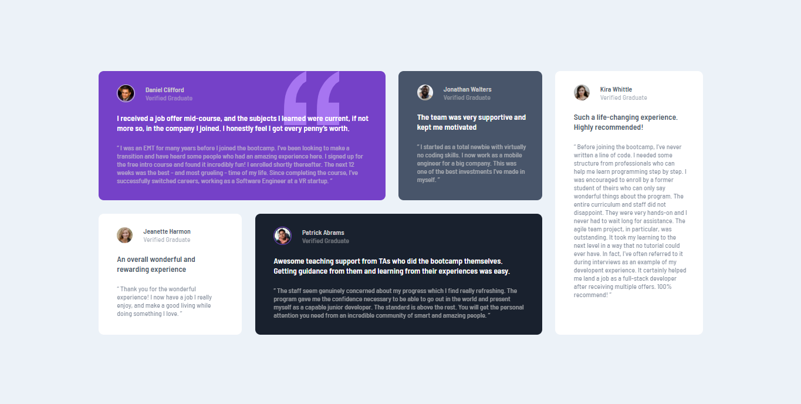

# Frontend Mentor - Testimonials grid section solution

This is a solution to the [Testimonials grid section challenge on Frontend Mentor](https://www.frontendmentor.io/challenges/testimonials-grid-section-Nnw6J7Un7).r, I added some hover effects on the card using CSS transform property to scale them a little percentage higher than their normal sizes.

## Table of contents

- [Overview](#overview)
  - [The challenge](#the-challenge)
  - [Screenshot](#screenshot)
  - [Links](#links)
- [My process](#my-process)
  - [Built with](#built-with)
  - [What I learned](#what-i-learned)
- [Author](#author)

## Overview

### The challenge

Users should be able to:

- View the optimal layout for the site depending on their device's screen size

### Screenshot

### Links

- Solution URL: [View my solution on frontend mentor](https://www.frontendmentor.io/solutions/responsive-grid-testimonial-section-with-nice-hover-effects-MB7eaDZOCa)
- Live Site URL: [View live site here](https://frontend-mentor-testimonials-grid-section-solution-uayw.vercel.app/)

## My process

### Built with

- Semantic HTML5 markup
- CSS custom properties
- Flexbox
- CSS Grid
- Mobile-first workflow

### What I learned

This project was fun as I learnt more about how css grids works. I used grid template columns and fractional units plus the thought process behind it to actually achieve the effect.

## Author

- Website - [Ovie Nathaniel On LinkedIn](https://www.linkedin.com/in/ovie-nathaniel/)
- Frontend Mentor - [@ovie-best](https://www.frontendmentor.io/profile/ovie-best)
- Twitter - [@oviebest_2](https://twitter.com/oviebest_2)
